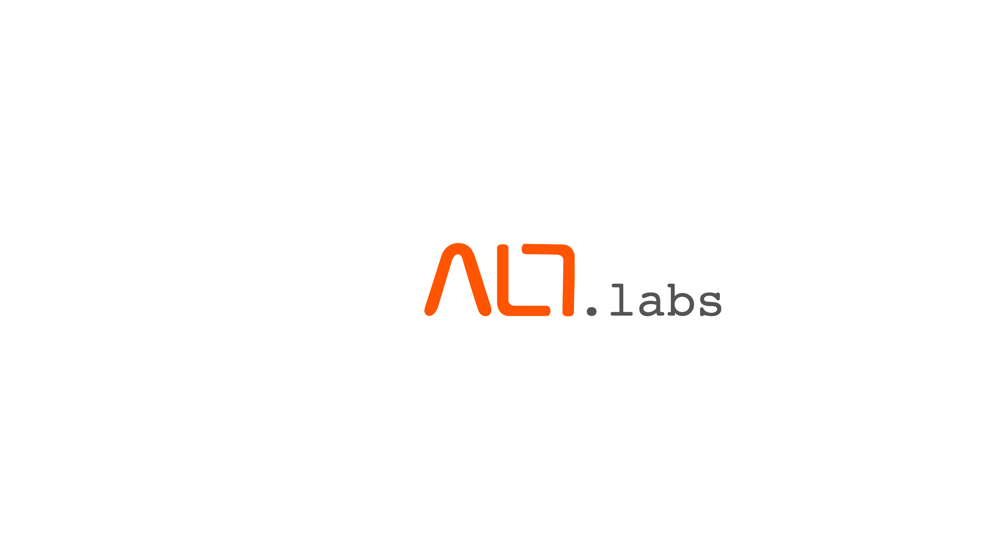

## About this repository

This repository is meant to be the reference source of all the codes and training materials used for the ALT.Labs sessions at Taylors University Malaysia jointly organized by Oxygen and Taylors University. The materials will grow with a collection of interesting and useful materials relevant in Industry 4.0.

Some codes are represented in IPython notebooks, because they offer a convenient way for describing the algorithm, benchmarking, maybe even visualization, and eventually sharing and viewing.
 
## About ALT.Labs
The Alt labs series aim to give participants of the community a detailed hands-on expertise on the latest technologies in the current Industrial revolution ranging from IOT, Cloud Computing, Robotics, AI & Big (Extreme) Data, and Cyber Security. Our aim is to share and exchange knowledge, solve real world problems and most importantly, create an AWESOME community and to DISRUPT.

 
 

# Alt Labs Series

Series 1
### Python for Beginners
- Python Crash Course
- Examples of data analysis
